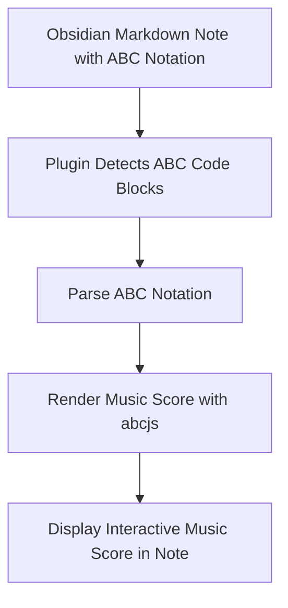

## Unlocking Your Music Notation Potential: An Accessible Quick Feature Overview

When you want to integrate and render music notation seamlessly within your Obsidian notes, having the right tools instantly available is essential. This page shows you the primary features of the plugin and reveals how it fits naturally into real-world workflows. Whether you're a musician, educator, or composer, understanding these capabilities helps you apply them immediately to your creative and documentation goals.

### What the Plugin Offers and Who Benefits Most

This plugin transforms ABC notation text embedded in your Obsidian markdown files into rich, interactive sheet music. It's designed primarily for users who want to document, share, and study music within their notes without leaving the Obsidian environment. Musicians benefit from instant playback and visualization, educators gain a convenient tool for music theory lessons, and composers appreciate quick embedding and iteration on their scores.

### How the Plugin Empowers Your Music Workflow

At its core, the plugin parses ABC notation from your markdown content and renders it via the abcjs library, presenting visually accurate music notation alongside interactive controls. When you open a note containing ABC code blocks, the plugin automatically detects and processes these snippets, converting them into readable music scores. This process happens transparently as part of Obsidian's markdown post-processing system, ensuring your score remains updated as you edit the underlying ABC text.

Here’s a simplified flow:



This flow guarantees a smooth integration from text input to music rendering without manual steps. The plugin also manages settings persistence and offers easy options for customization and saving your preferences within Obsidian.

### Using Features in Practical Situations

Imagine you are preparing lesson notes for a music theory class. Writing ABC notation directly in your note, you immediately see the professional sheet music format, which you can play back to demonstrate melodies. This instant feedback loop accelerates your teaching and makes sharing scores with students effortless.

Alternatively, a composer drafting themes can embed multiple variations side-by-side. Each block renders as a distinct score, allowing direct comparison inside the same note without switching apps. The plugin handles these scenarios robustly, ensuring that any changes to the ABC text instantly update the rendered score.

A brief example of embedding ABC notation:

```markdown
```abc
X:1
T:Example Tune
M:4/4
L:1/8
K:C
CDEF GABc|
```
```

After saving, this block transforms into a clear sheet music display with playback controls right in your note, letting you listen and refine your notation seamlessly.

### Getting Started Preview and Next Steps

To start harnessing these capabilities, you’ll need to set up the plugin within Obsidian by following the installation guidelines, configuring your preferences, and running your first notation rendering. The plugin offers straightforward configuration options to tailor the music notation appearance and playback behavior to your needs.

For details on setup and initial configuration, see the [Prerequisites and Installation](/getting-started/setup-and-first-run/prerequisites-and-installation) and [Configuration and Initial Setup](/getting-started/setup-and-first-run/configuration-and-initial-setup) pages. Once set up, you can quickly verify your installation with the [First Run & Verification](/getting-started/setup-and-first-run/first-run-and-verification) guide.

<Tip>
Before writing complex notation, experiment with simple ABC code blocks to see live rendering and playback within Obsidian. This helps you familiarize yourself with the syntax and plugin behavior.
</Tip>

<Source url="https://github.com/abcjs-music/obsidian-plugin-abcjs" branch="main" paths={[{"path": "plugin.ts", "range": "1-120"}]} />
