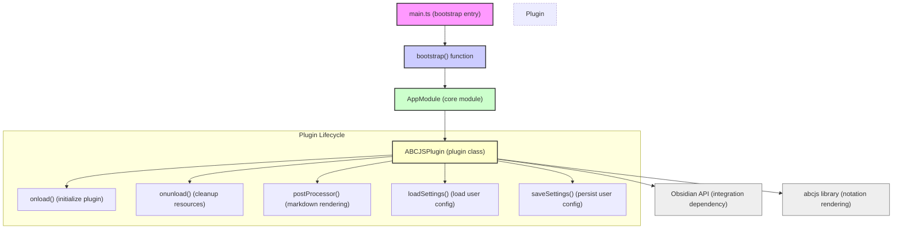

## Understanding the System Architecture Overview

Navigating a new product can often feel overwhelming, especially when the internal structures and flows are unclear. This overview paints a clear, high-level picture of how the main application bootstrap interacts with its internal modules, empowering you to move confidently from onboarding to active use. By visualizing these connections, you can grasp the core structure at a glance, speeding up troubleshooting and customization.

## What This Page Covers and Its Audience

This page offers a strategic look into the system architecture, laying out the relationship between key source files and components. It is designed for developers, maintainers, and advanced users who want to understand how the application initializes and coordinates its internal modules. Whether you’re preparing to extend functionality, debug, or simply comprehend how pieces fit together, this explanation ensures your foundation is solid.

## High-Level Architecture: How the Components Interconnect

At the heart of the application lies the bootstrap sequence initiated in the `main.ts` file, which serves as the entry point of the system. This process triggers the assembly of the `AppModule`, a container that organizes core dependencies and services. Within this module, the `ABCJSPlugin` class encapsulates the plugin’s main functionality, managing lifecycle events such as loading, unloading, and settings management.

The architecture relies on native integration with external dependencies like Obsidian APIs and the abcjs library, which are leveraged to provide music notation rendering capabilities and seamless integration within the application environment. Core lifecycle functions such as `onload`, `onunload`, and `postProcessor` enable the plugin to interact dynamically with the host by registering processors and managing user settings.



This diagram clarifies the initialization flow starting from application bootstrap to module instantiation, showcasing how plugin lifecycle methods enable smooth integration with the environment and user interaction.

## Real-World Context: Architecture in Action

Imagine a user enabling the plugin within their environment for the first time. The bootstrap triggers `main.ts`, which sets up `AppModule`. This module constructs an instance of `ABCJSPlugin`, where `onload()` kicks off: loading settings to respect the user's preferences and registering markdown post-processors to render music notation inline.

As the user edits documents, `postProcessor()` dynamically processes markdown sections labeled for music notation, rendering clear, interactive sheet music powered by `abcjs`. If settings change, `saveSettings()` guarantees persistence across sessions. Finally, when the user disables the plugin or closes the environment, `onunload()` ensures graceful cleanup of resources, avoiding memory leaks or orphaned listeners.

Here is a simplified snippet illustrating the loading phase in `ABCJSPlugin`:

```typescript
async onload() {
  await this.loadSettings();
  this.registerMarkdownPostProcessor(this.postProcessor.bind(this));
  // Additional initialization steps...
}
```

This illustrative fragment reflects how the architecture facilitates a smooth user experience while maintaining modular clarity.

## Getting Started: What’s Next After Understanding Architecture

With this foundational understanding, you are prepared to approach setup and initial configuration with greater insight. To implement or customize effectively, consult the [Prerequisites and Installation](/getting-started/setup-and-first-run/prerequisites-and-installation) page for environment setup and the [Configuration and Initial Setup](/getting-started/setup-and-first-run/configuration-and-initial-setup) page to tailor plugin behavior to your needs. These steps build on the structural knowledge you now possess, ensuring your journey from installation to productive use is intuitive and efficient.

<Source url="https://github.com/abcjs-music/obsidian-plugin-abcjs" branch="main" paths={[{"path": "main.ts", "range": "1-70"},{"path": "plugin.ts", "range": "1-120"}]} />