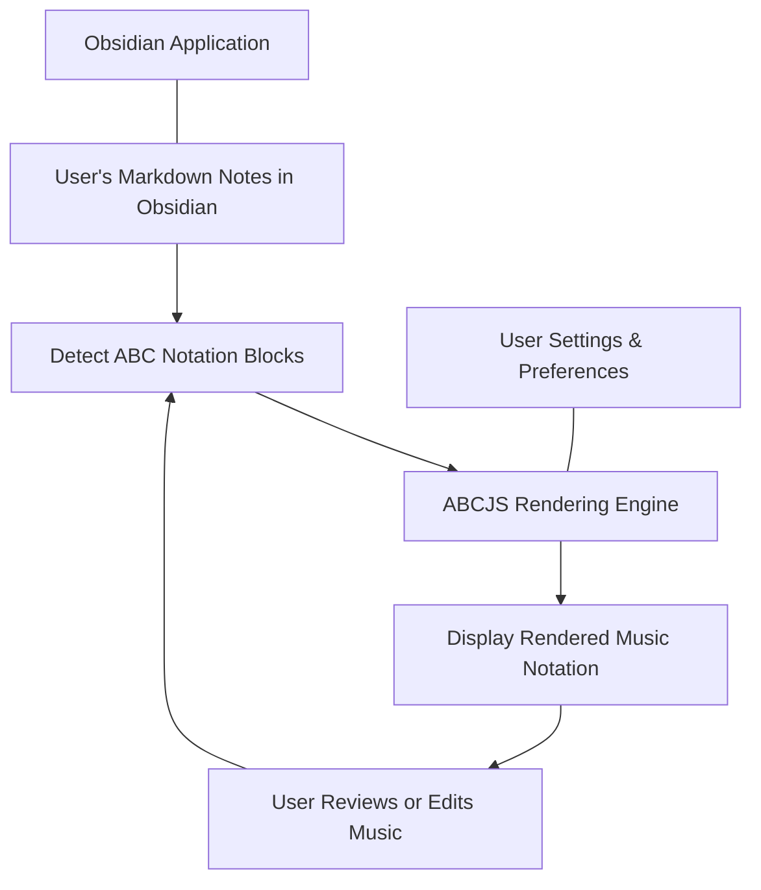

## Discovering What This Product Does

In today’s fast-paced digital world, integrating music notation directly within your note-taking environment can transform how you work with musical ideas. This product empowers users to seamlessly embed, visualize, and interact with ABC music notation inside Obsidian, a popular markdown-based knowledge management app. By bridging the gap between textual notes and rich musical content, it streamlines the creative process, making musical documentation intuitive and accessible.

## Defining the Product and Its Users

At its core, this product is an Obsidian plugin that leverages the ABCJS library to render ABC notation into readable music sheets within markdown files. This capability transforms plain text ABC code into clear, interactive musical scores right where you take notes. It suits musicians, composers, music educators, and enthusiasts who rely on Obsidian to organize ideas but need a powerful way to integrate music notation into their workflow without switching tools.

## How the Plugin Works Behind the Scenes

The plugin activates whenever you open or edit notes containing ABC notation. It processes these code blocks using the ABCJS rendering engine embedded within Obsidian's environment, dynamically converting notation into scalable musical staff visuals. Settings and user profiles govern how the notation is displayed and interacted with, ensuring a personalized experience. This seamless conversion happens in the background, giving you an immediate, clear view of the music embedded in your notes.



This flow ensures users experience real-time, visually rich music notation alongside their textual notes, with the freedom to modify both content types effortlessly.

## Experiencing the Product: Bringing Musical Ideas to Life

Imagine you are a composer drafting notation directly within your diary or project documentation in Obsidian. By simply writing ABC notation in a code block, the plugin instantly renders your score, allowing you to verify rhythms, melodies, or harmonies visually. When you adjust playback preferences or customize appearance, the plugin remembers settings to suit your style. For music teachers, it enables embedding exercises directly into lesson notes, making sharing and revision smoother.

For instance, adding this markdown snippet:

```markdown
```abc
X:1
T:Sample Tune
M:4/4
L:1/8
K:C
CDEF GABc|
```
```

will show a beautifully rendered music staff previewing the tune, making your notes both informative and engaging.

## Starting Your Journey with the Plugin

Getting started involves installing the plugin within Obsidian’s community plugin marketplace, followed by minimal configuration to tailor rendering preferences to your needs. Once enabled, your markdown files begin to display interactive music scores immediately upon recognizing notation blocks. For setup details and troubleshooting tips, explore the [Getting Started](/getting-started/setup-and-first-run/prerequisites-and-installation) section to ensure a smooth launch.

This introduction sets the stage for integrating music into your Obsidian notes effortlessly, enhancing creativity and documentation.

<Source url="https://github.com/abcjs-music/obsidian-plugin-abcjs" paths={[{"path": "plugin.ts", "range": "1-150"}, {"path": "main.ts", "range": "1-100"}]} />